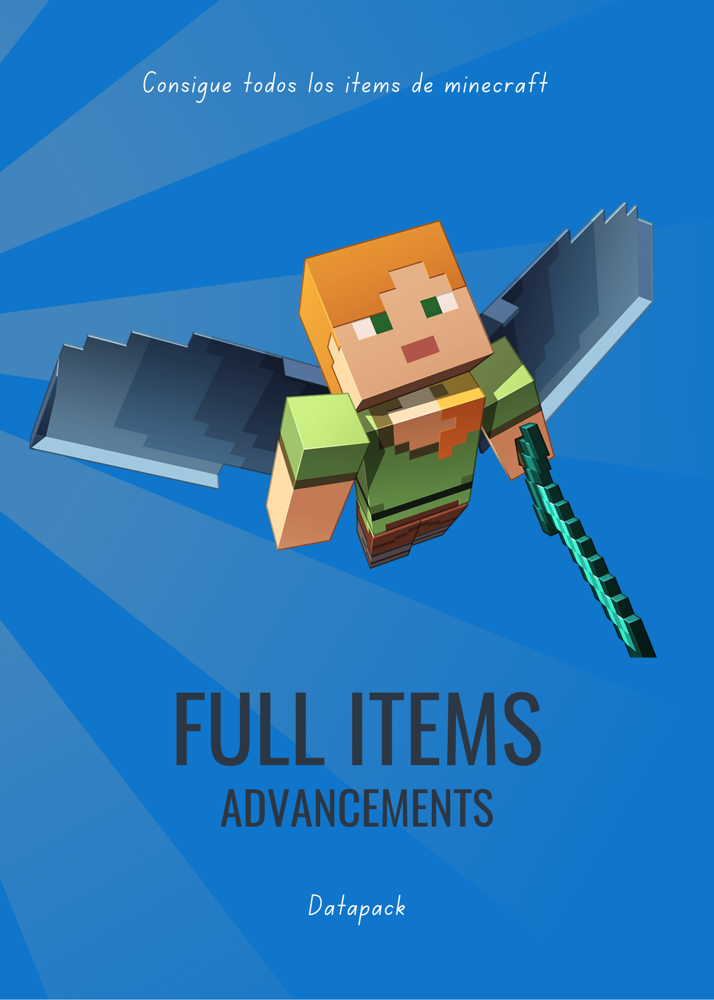
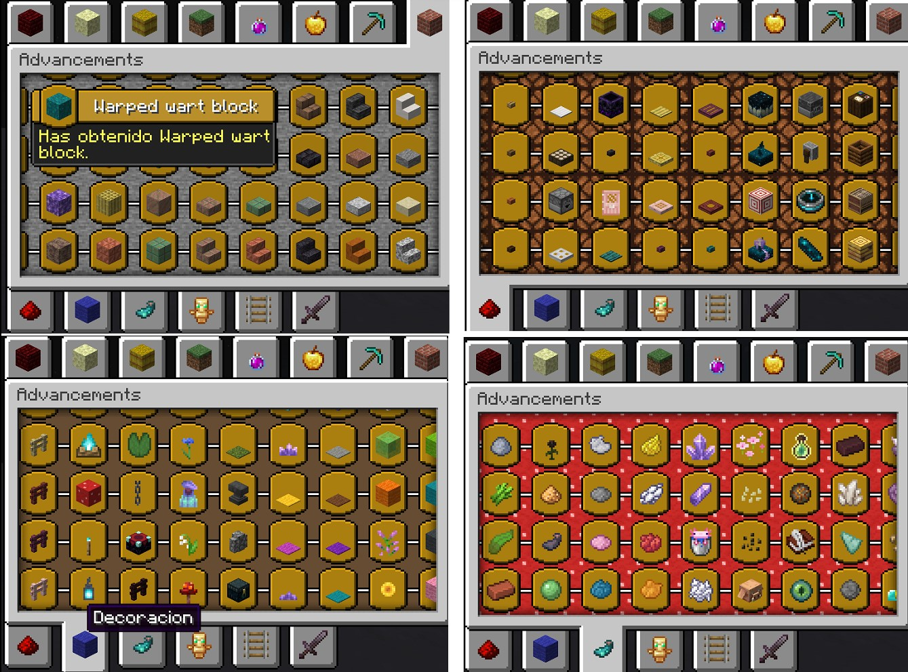
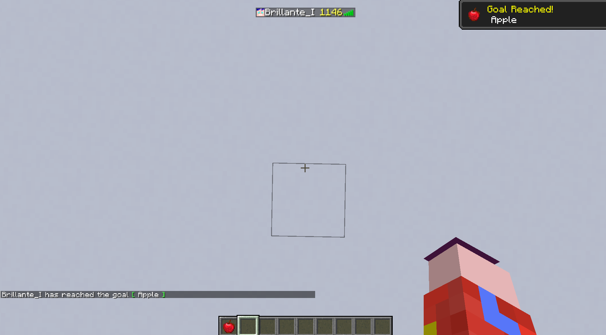
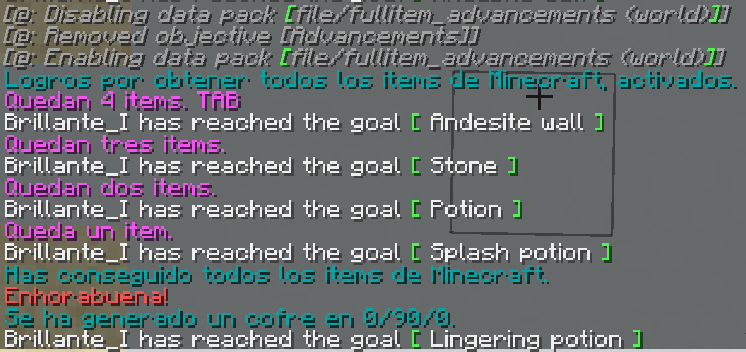
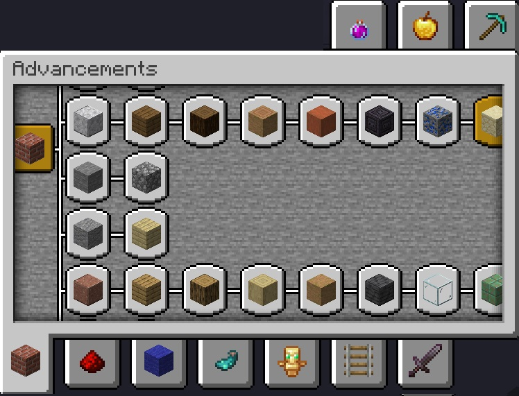
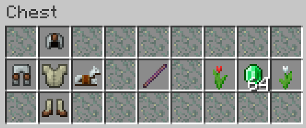
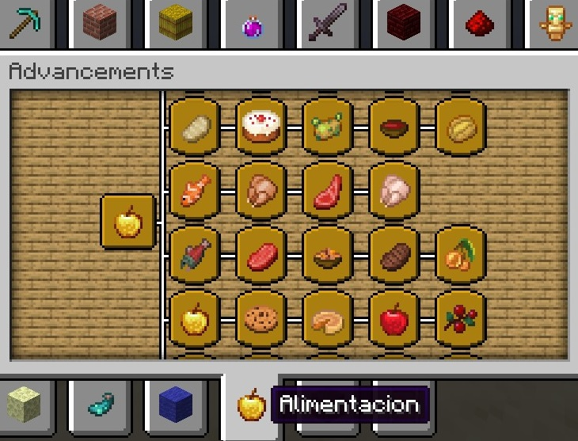

# Full Items Advancements
Consigue todos los items de Minecraft y visualízalo con este datapack. Un logro por cada item.

Un reto con muchas aventuras.

  

## Descripción
Este datapack posee las funciones necesarias para tener **un logro por cada item de Minecraft**. Incluye conteo y visualización de los items conseguidos y de los restantes. El total de estos logros en la primera versión son; **1148 items**.

Se puede jugar en multijugador y sigleplayer. 

## Descargas
- Datadack en github [Descargar pulsando en download](https://github.com/iSeeQR/fullitem_advancements/blob/main/descargas/fullitem_advancements_1_20.zip)
- Datadack [Drive](https://drive.google.com/file/d/1EnOIU2QD-jJFW2aaZKJhFLgtvGSCvZ9j/view?usp=drive_link)
- MapJamRichMaps [Drive](https://drive.google.com/file/d/1oxZULKsCVq-iL0I0GLAwALWOWfY4Xu1v/view?usp=drive_link)
  
El mundo de MapJamRichMaps es para testeo. El **datapack** se ha creado **para mundos vanilla**. No puedo asegurar que se puedan conseguir todos los items en este mundo. Pero si podrás testearlo.
  

## Descripción general
El jugador iniciará el mundo con el datapack incluido y ya estará listo para comenzar la aventura. 

Al detectar un cambio en el inventario se activarán los logros.

En la siguiente imagen se pueden ver los texto que componen el principio y el fin de la obtención de todos los logros. (Simulado en test. Los texto han sido mejorados en la versión final)

Los items están dividido en las siguientes secciones:

Construcción, decoración, redstone, transporte, objetos varios, alimentación, herramientas, combate, pociones y honestidad.

## Recompensa
¡Si consigues todos los items tendrás un buen premio!

La persona que a dedicado el tiempo al estudio, búsqueda y crafteo de cada item. Querrá un Debug Stick para admirar fácilmente la preciada colección de su museo.

## Otras ventajas 
Si quieres conseguir el logro de comer todos los alimentos. Este datapack puede ayudarte con esa tarea.

## Descripción técnica
Cada item tiene su logro, el cual se define como en el siguiente ejemplo
    
    {
      "display": {
        "description": {
          "text": "Has obtenido Cod.",
          "color": "yellow"
        },
        "title": {
          "text": " Cod ",
          "color": "white"
        },
        "icon": {
          "item": "minecraft:cod"
        },
          "frame": "goal",
          "show_toast": true,
          "announce_to_chat": true,
          "hidden": false
      },
      "criteria": {
        "stone": {
          "trigger": "minecraft:inventory_changed",
          "conditions": {
            "items": [
              {
               "items":[ "minecraft:cod" ]}          
            ]
          }
        }
      },
      "rewards": {
        "function": "function:alimentacion/cod"
      },
      "parent": "fullitem:alimentacion/root"
    }
    

Al conseguir este logro se dispara la lectura por ejemplo de la siguiente función

    ...
    execute as @p[scores={Advancements=10}] run tellraw @p {"color":"light_purple","text":"Quedan 10 items."} 
    ...

El conteo de items se hace mediante scoreborad dummy

## Generación datapack.
El datapack se genera mediante un proceso en Java que crea todos los directorios y ficheros. En dicho código se encuentran los comandos que serán escritos en los ficheros del datapack. 

__De otra manera sería imposible crear este proyecto. Es un proceso Java que genera código para Minecraft Java.__

## Testeo
1. Se ha testeado el logro de cada item
2. Se ha testeado la aparición de la recompensa al conseguir todos los items

## Mantenimiento y soporte
Gracias al proceso Java creado se procura un **soporte y mantenimiento** del datapack con el paso del tiempo. Incluyendo versiones futuras.

## RoadMap
- **Añadir items que faltan:** Items como los cuernos, cuadros, flechas encantadas, libros encantados y pociones deben distinguirse en logros individuales. Estos items están recogidos en la pestaña "honestidad" de los logros.
- **Organización de los logros:** Hay que reestructurar las items.
- **Goals:** Para items como el banner de creeper, la mena negra de esmeralda, cabeza de piglin, etc hay que poner un Goal legendario
- **Añadir el banner ominous:** Estudiar como incluirlo en un logro.

## Descripción concurso
Map Jam Hispana: Comandos Creativos 2023

[Bases de concurso](https://www.patreon.com/posts/86402247)
- Una frase de qué es lo que más te gusta de lo que has creado:

    Satisfacer una necesidad de algunos jugadores. Incluido yo. En mi mundo juego a conseguir todos los items. Crear este datapack es lo que más me ha gustado.
    Estudiar, aprender y trastear con /execute
  
- Una frase de qué añadirías si tuvieses quince días más.
  
    Añadir los items que faltan. Las flechas encantadas, pociones, libros encantados... Hay que dedicarle tiempo a estos items ya que su diferenciación no es sencilla. En 15 días sería mi objetivo principal.

---

__Proyecto desarrollado 100% por un humano. 0% IA.__

